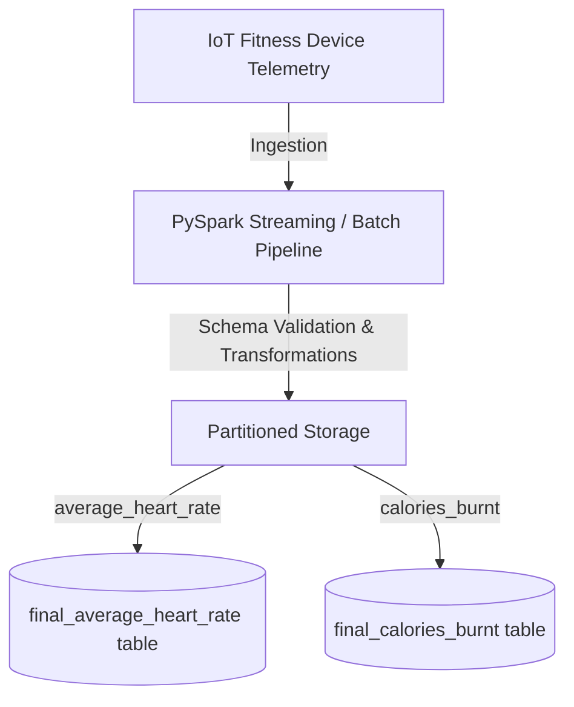

# 📊 Data-Pipeline-Automation

[](https://spark.apache.org/)
[](https://databricks.com/)
[](https://www.python.org/)
[](#)

An automated data pipeline for processing, transforming, and querying IoT fitness device telemetry. This repository contains the Databricks PySpark notebook, sample datasets, and SQL DDL schemas for implementing a pipeline that aggregates metrics such as average heart rates and calories burnt.

---

## 📂 Repository Structure

```text
Data-Pipeline-Automation/
├── IoT Machine Stream PySpark.dbc  # Databricks PySpark notebook archive
├── average_heart_rate.json          # Sample output dataset for Heart Rate tracking
├── average_heart_rate.txt           # Spark SQL DDL for the Heart Rate external table
├── calories_burnt.json             # Sample output dataset for Calories Burnt tracking
└── calories_burnt.txt              # Spark SQL DDL for the Calories Burnt external table
```

---

## ⚙️ Pipeline Overview

This pipeline is designed to ingest fitness IoT telemetry, transform it using Spark, and store it in partitioned external tables.



### 1. Ingest & Transform (PySpark)
The `IoT Machine Stream PySpark.dbc` is a Databricks Notebook Archive. It contains the logic to:
- Read incoming device telemetry streams/batch data.
- Perform windowing, schema validation, and data cleaning.
- Extract step counts, miles walked, timestamps, and target metrics (heart rate, calories burnt).

### 2. Schema DDL & Partitioning
To ensure high query performance, data is saved in Hive/Spark external tables partitioned by `user_id`.

#### 💓 Heart Rate Schema (`final_average_heart_rate`)
* **Partition Key**: `user_id` (BigInt)
* **Fields**:
  * `average_heart_rate` (BigInt)
  * `device_id` (BigInt)
  * `miles_walked` (Double)
  * `num_steps` (BigInt)
  * `time_stamp` (Timestamp)
  * `sample_new_field` (String)

#### 🔥 Calories Burnt Schema (`final_calories_burnt`)
* **Partition Key**: `user_id` (BigInt)
* **Fields**:
  * `calories_burnt` (Double)
  * `device_id` (BigInt)
  * `miles_walked` (Double)
  * `num_steps` (BigInt)
  * `time_stamp` (Timestamp)
  * `sample_new_field` (String)

---

## 🚀 Getting Started

### 1. Import Notebook into Databricks
1. Open your **Databricks Workspace**.
2. Navigate to your user workspace or preferred folder.
3. Click on the dropdown arrow next to the folder name and select **Import**.
4. Upload `IoT Machine Stream PySpark.dbc`.
5. Open the imported notebook and attach it to an active Spark cluster.

### 2. Configure Sample Data
You can upload the `average_heart_rate.json` and `calories_burnt.json` files to DBFS (Databricks File System) or cloud object storage (AWS S3, ADLS Gen2, GCS) to test the pipeline logic.

### 3. Create External Tables
Run the DDL scripts in your Databricks SQL Warehouse or direct PySpark SQL context to create the target tables:

```sql
-- Create Average Heart Rate External Table
CREATE EXTERNAL TABLE `final_average_heart_rate`(
  `average_heart_rate` bigint, 
  `device_id` bigint, 
  `miles_walked` double, 
  `num_steps` bigint, 
  `time_stamp` timestamp, 
  `sample_new_field` string
)  
PARTITIONED BY (`user_id` bigint)
LOCATION '/path/to/heart_rate_data';
```

---

## 🛠️ Tech Stack & Prerequisites
* **Runtime**: Apache Spark (Databricks Runtime 10.x or higher recommended)
* **Languages**: PySpark (Python), Spark SQL
* **Data Format**: JSON (Ingested), Parquet/Delta (Target storage recommended)
* **Partitioning strategy**: Partitioned by `user_id` for optimal tenant-level queries.
